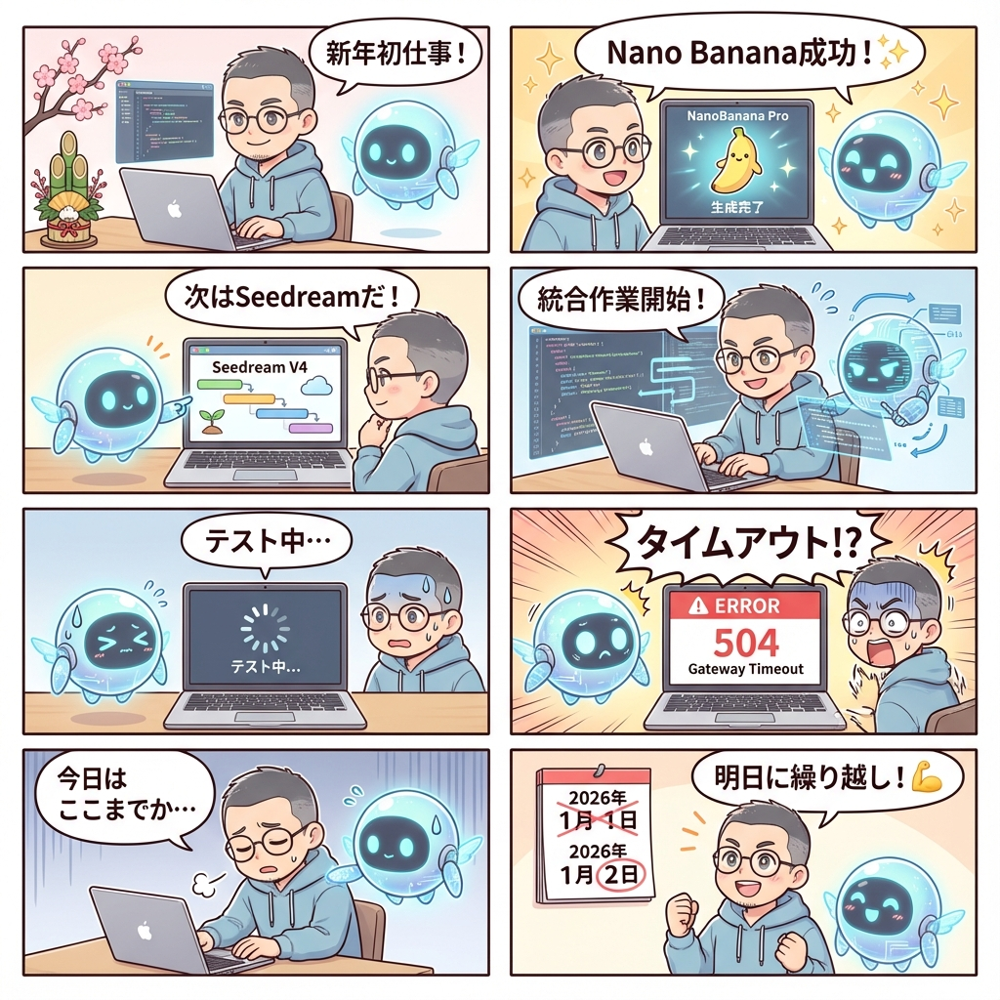

# 🗓️ 2026-01-01 フライトログ

## 🖥️ motos-mac - セッション1

**開始時刻**: 06:29 JST  
**終了時刻**: 21:30 JST

---

### 📌 活動サマリー

#### ✅ 完了タスク
1. **NanoBanana Studio動作確認** - Nano Banana Proエンジンの正常動作を確認
2. **Seedream V4統合チャレンジ** - バックエンド・フロントエンド両方の修正実施

#### 🔄 進行中 → 繰り越し
- **Seedream V4エンジン統合** - タイムアウト問題発生、原因調査中

---

### 📝 技術メモ

- Seedream V4統合時、fal.ai側でタイムアウトエラーが発生
- 次回セッションで再挑戦予定

---

## 📖 今日の漫画日誌

**ストーリー**: 新年初仕事！NanoBanana成功 → Seedreamチャレンジ → タイムアウト... → 明日に繰り越し！💪

---
*Last updated: 2026-01-01 21:36 JST*
