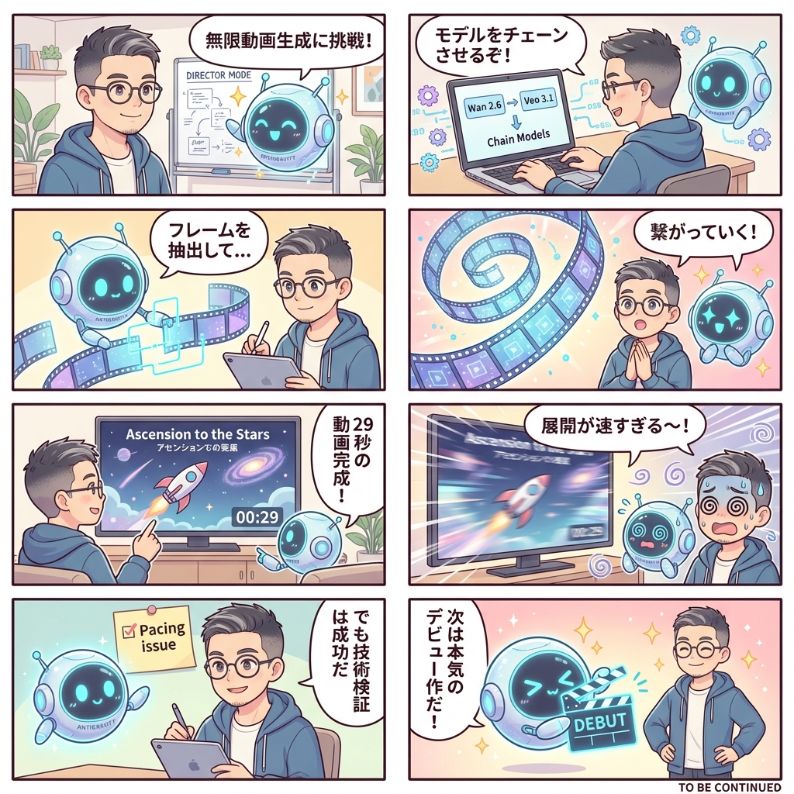

# 2026-01-02 Flight Log: Antigravity Director Mode 🚀

## 📝 Activity Summary
- **Concept**: "Antigravity Director Mode" (SVI 2.0 Pro Alternative)
- **Objective**: Implement infinite video generation using existing Kamui MCP tools (Wan 2.6 + Veo 3.1) by chaining frames.
- **Result**: Successfully created a 29s continuous video "Ascension to the Stars".

## 🛠 Technical Details
### Workflow
1.  **Base Generation**: Wan 2.6 T2V (5s)
2.  **Chaining Loop**:
    - Extract last frame (ffmpeg)
    - Upload to Fal Storage
    - Generate Extension with Veo 3.1 I2V (8s)
3.  **Assembly**: Concatenate all clips using ffmpeg.

### Artifacts
- Script: `Antigravity-Director/frame_utils.js`
- Output: `Antigravity-Director/final_movie_29s.mp4`

## 💡 Insights & Next Steps
- **Feasibility**: Verified that Wan + Veo chaining can effectively simulate "infinite" video generation.
- **Feedback**: Story pacing was too fast; continuity needs improvement.
- **Plan**:
    - User to plan a solid storyboard for a "debut masterpiece".
    - Refine the chain logic for better consistency.

> "We are the music makers, and we are the dreamers of dreams."

---

## 📖 Daily Manga Digest

**Story**: Antigravity Director Mode Challenge!
1. Start "Director Mode" experiment.
2. Chain Wan 2.6 and Veo 3.1.
3. Looping the generation process.
4. It keeps connecting!
5. 29s video completed!
6. Too fast! Dizzy...
7. Tech validation successful.
8. Next: The Debut Masterpiece! 🎬

---
*Last updated: 2026-01-02 19:30 JST*
